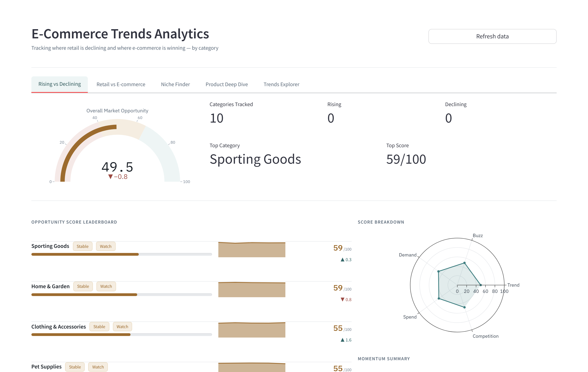
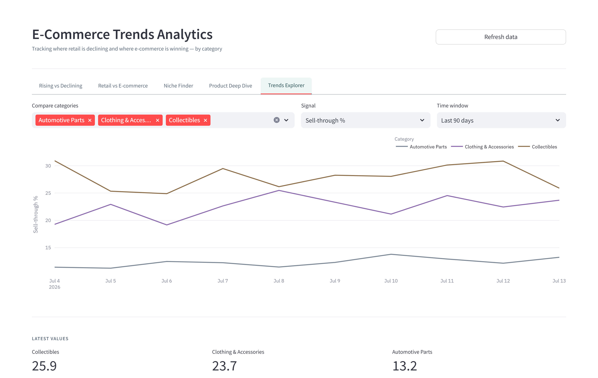
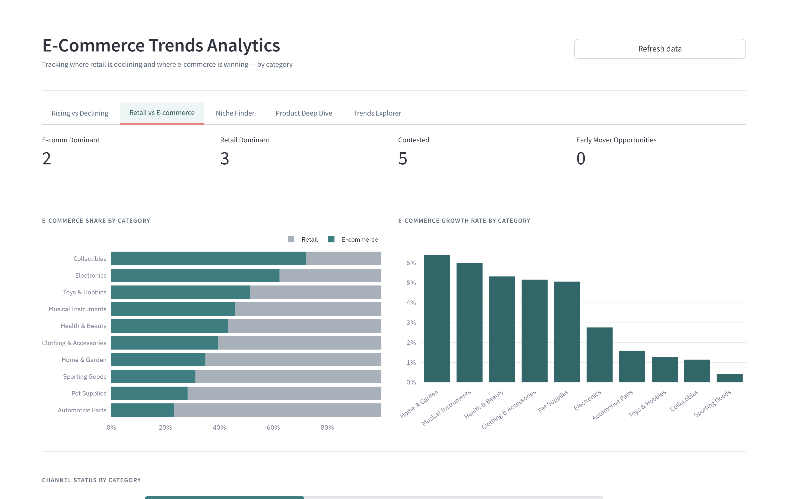

# E-Commerce Market Analyzer

A Python ETL pipeline and Streamlit dashboard that pulls e-commerce and consumer-trend signals (eBay category performance, Google Trends search interest, Reddit chatter, and BLS consumer spending data) into Postgres, then scores each product category on where e-commerce is beating retail and which niches are worth entering.



<details>
<summary>More views</summary>

**Multi-category trend explorer**


**Retail vs e-commerce channel share**


</details>

## What it does

- Ingests category data from eBay's Browse API, Google Trends (`pytrends`), Reddit (`praw`), and a BLS Consumer Expenditure Survey CSV
- Cleans and normalizes each source, then loads it into a 6-table Postgres schema with idempotent upserts
- Computes a composite "opportunity score" per category from trend momentum, Reddit buzz, sell-through rate, spend growth, and listing competition
- Pre-aggregates everything into 4 materialized views for fast dashboard reads, plus a library of analytical CTE and window-function queries for ad hoc digging
- Renders it all in a 5-tab Streamlit dashboard: Rising vs Declining, Retail vs E-commerce, Niche Finder, Product Deep Dive, and Trends Explorer

## Tech stack

Python, PostgreSQL, SQLAlchemy, Streamlit, Plotly, APScheduler

## Architecture

```
etl/ingest.py     -> pulls raw data from eBay / Google Trends / Reddit / BLS CSV
etl/transform.py  -> cleans, normalizes, dedupes each source
etl/load.py       -> upserts into the 6 base tables
etl/pipeline.py   -> orchestrates ingest -> transform -> load -> score -> refresh views
etl/scheduler.py  -> runs the pipeline on a schedule (APScheduler)

db/schema.sql                     -> category_trends, retail_vs_ecomm, search_signals,
                                      social_buzz, consumer_spend, niche_scores
db/queries/materialized_views.sql -> mv_category_leaderboard, mv_channel_comparison,
                                      mv_niche_finder, mv_trends_explorer
db/queries.py                     -> query layer the dashboard calls
db/seed.py                        -> synthetic demo dataset, no API keys needed

dashboard/app.py -> Streamlit + Plotly UI
```

## Running locally

```bash
cp .env.example .env       # leave API keys blank if you're using the seed data
docker compose up --build  # Postgres on schema init + Streamlit on :8501
python -m db.seed          # loads synthetic demo data, no API keys required
```

To run the real pipeline instead of the seed data, add eBay/Reddit/Rainforest API keys to `.env` and run `make pipeline`.

```bash
python -m db.seed --days 14   # more history
python -m db.seed --reset     # wipe and reseed
```

See the `Makefile` for other shortcuts (`make test`, `make db-shell`, `make db-reset`).

## Configuration

`db/connection.py` reads `DATABASE_URL` first (for hosted Postgres like Neon or Supabase), falling back to discrete `DB_USER` / `DB_PASSWORD` / `DB_HOST` / `DB_PORT` / `DB_NAME` for local Docker. See `.env.example` for both.

## Tests

```bash
pip install -r requirements.txt
pytest tests/ -v
```

33 tests cover transform logic, opportunity-score invariants, SQL-injection-safe query building, and DB health checks. No live database needed to run them.

## Deploying

Not deployed yet. See [DEPLOYMENT.md](DEPLOYMENT.md) for the walkthrough to get this live on a free Neon/Supabase Postgres instance plus Streamlit Community Cloud in about 10-15 minutes. The screenshots above are from a local run against seeded demo data.
